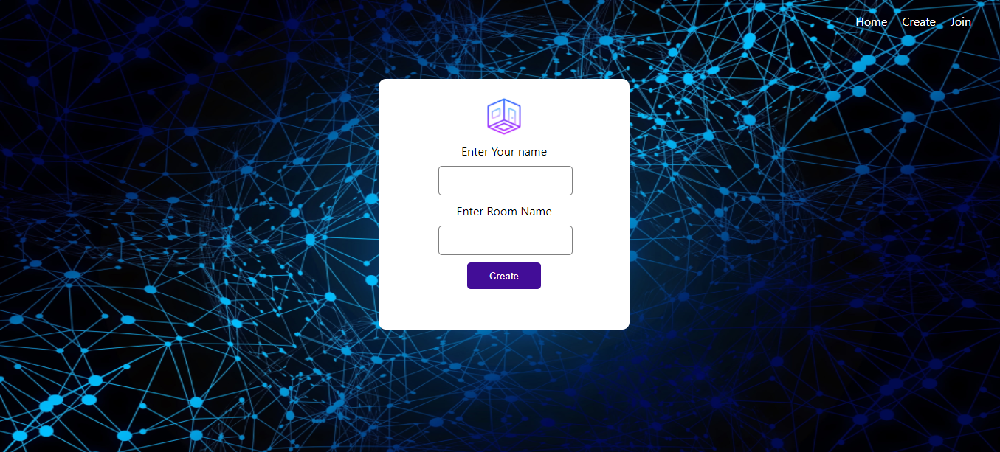

# chit-chat
An simple chat application.
  

  
<h4>Tech Stack</h4>
 HTML |
 CSS |
 JAVASCRIPT |
 REACT |
 EXPRESS |
 SOCKET.IO |
 MONGO 

<h4>Simple Steps to start chating</h4>
<strong>step-1</strong> : Create your a room by giving your name and room name  
<strong>step-2</strong> : Share the room id with the participants  
<strong>step-3</strong> : Join any room by typing your name and room id  
<strong>step-4</strong> : Start chating  
<h4>Demo</h4>

  

 
<h3 align="left">Connect with me:</h3>

